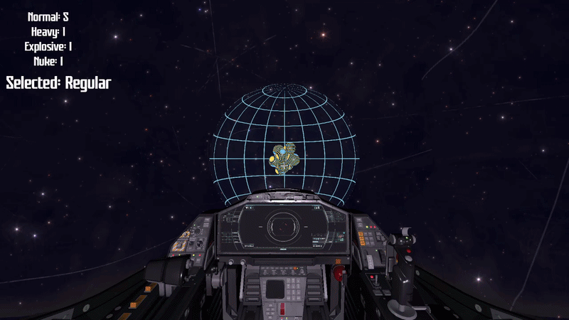
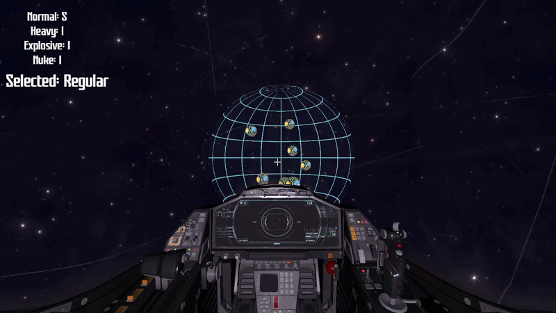
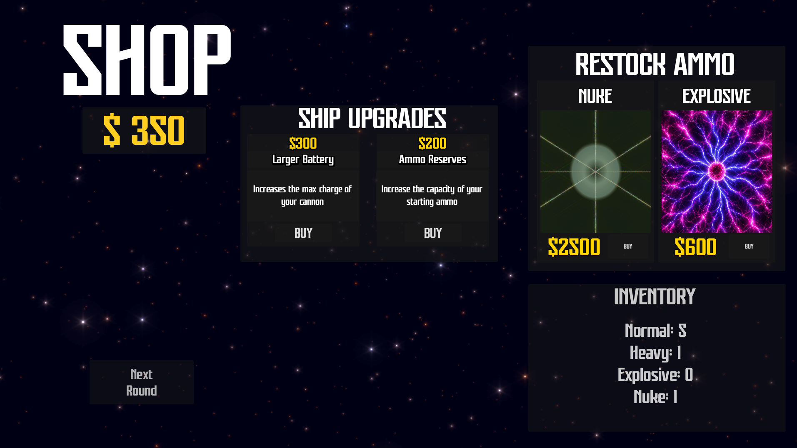

# Kyklos
### A Physics-Based Roguelike in Space!

## Overview
Kyklos is a 3D physics-based roguelike developed in Godot 4 where players orbit Kyklon clusters while launching different projectile types to collect Kyklons and survive increasingly difficult rounds.

The project combines:
- Orbital movement
- Physics-based projectile
- Roguelike progression
- Dynamic camera systems
- Upgrade and economy mechanics

Built over 8 weeks by a team of 3 developers as a university capstone project.

---

## Features

### Orbital Flight System
- Full 360° orbital movement around planets
- Smooth drift-based camera controls
- Momentum-inspired movement system

### Multiple Projectile Types
- Regular
- Heavy
- Explosive
- Nuclear

Each projectile changes gameplay strategy and projectile physics.

### Charge Shot Mechanics
- Hold-to-charge firing system
- Dynamic aim sway
- Variable launch force based on charge timing

### Roguelike Progression
- Persistent currency system
- Upgrade shop between rounds
- Scaling difficulty progression

---

## Technical Highlights

### Technologies Used
- Godot 4
- GDScript
- Blender assets
- Git + GitHub

### Key Systems
- Signal-driven UI architecture
- Modular projectile framework
- Physics-based launch calculations
- Scene-based game architecture
- Audio state management

---

## Architecture

### Core Systems
| System | Description |
|---|---|
| GameManager | Global game state and progression |
| Orbit Controller | Handles movement, aiming, firing |
| Projectile System | Projectile spawning and behavior |
| UI System | Ammo tracking and menus |
| Shop System | Upgrades and economy |

---

## Development Timeline

The project was developed across 8 weeks using sprint-based iteration.

Major milestones included:
1. Core orbital movement
2. Cluster generation
3. Projectile physics
4. UI systems
5. Roguelike progression
6. Audio/visual polish
7. Web/downloadable deployment

---

## Challenges & Lessons Learned

Some major engineering challenges included:
- Managing complex scene hierarchies in Godot
- Designing smooth orbital camera movement
- Synchronizing UI updates using signals
- Optimizing large assets for deployment
- Maintaining Git merge consistency in a multi-person team

This project reinforced the importance of:
- Modular architecture
- Source control discipline
- Iterative testing
- Early optimization planning

---

## Future Work

Potential future improvements:
- In-depth procedural cluster generation
- Additional projectile types
- Additional shop items
- Improved visual effects

---

## Credits

### Team Members
- Ezra Lovett — Gameplay Systems / Physics / UI / Audio
- Augusto Penzo Jara — Gameplay Systems / Physics
- Aaron Escalera - UI / Art

### Assets & Tools
- Godot Engine
- Sketchfab cockpit assets
- Any audio/model sources

---

## Download / Play

Playable build available on itch.io:

[ITCH.IO LINK](https://ezthefez.itch.io/kyklos)
